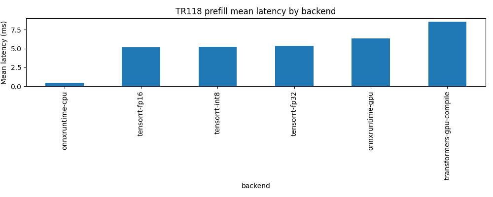
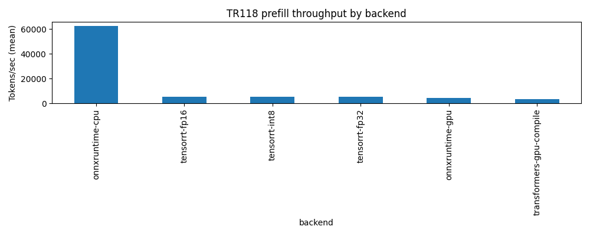
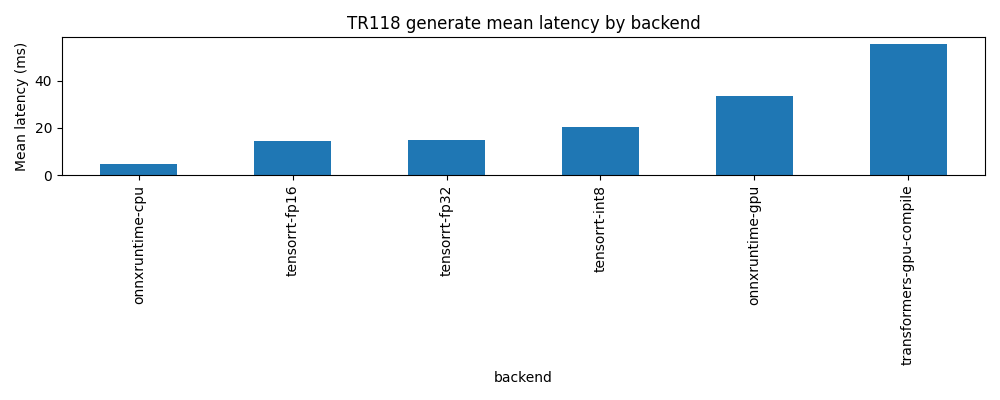
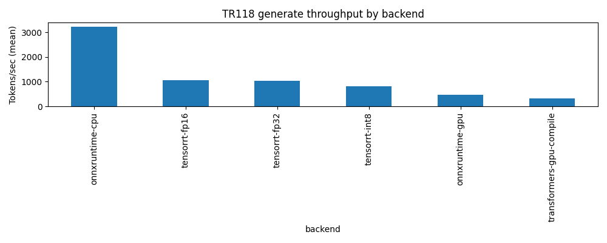
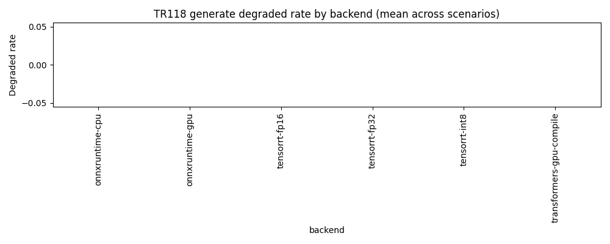

# Technical Report 118: ONNX Runtime + TensorRT Deep Dive


**Version:** 1.0
**Date:** 2025-12-12
**Status:** Complete (artifact-driven)
**Git SHA:** `92275d856cfcabbe058e8fec534ba0a378052705`

## Abstract

TR118 deep-dives ONNX Runtime and TensorRT for local-first LLM inference, closing the TR117 gap where ONNX/TRT runs were fully degraded.
We report performance, degraded-rate, and accuracy (perplexity) gates, using artifact-driven reproducibility (JSONL + CSV + manifests).

## Executive Summary

### Key Findings

- Reliability: 6 run-level records across prefill, generate; degraded-rate = 0.0% (0/6)
- Accuracy: perplexity gate passed (see `scripts\tr118\results\processed\perplexity_results.csv`)
- prefill: best mean latency = tensorrt-fp16 (1.01 ms), vs baseline transformers-gpu-compile (137 ms, -99.26%)
- generate: best mean latency = tensorrt-fp16 (8.19 ms), vs baseline transformers-gpu-compile (160 ms, -94.87%)
- Note: PyTorch `transformers-gpu-compile` uses `torch.compile(..., backend="cudagraphs", dynamic=False)` on Windows (no Triton).

### Honest Limitations

- `generate` mode is an uncached greedy loop (`use_cache=False`) and is not representative of KV-cached decoding throughput.
- Single model (tiny-gpt2) and single machine; results may not generalize to larger models (see TR121).
- Latency excludes end-to-end serving overhead (tokenization, networking, batching policies).

## Introduction

- TR117 established a cross-backend baseline and identified ONNX/TRT infrastructure failures.
- TR118 focuses on making ONNX export + TRT engine builds real and measurable, with explicit degraded reasons and accuracy gates.

## Methodology

### Metrics
- Latency (ms), throughput (tok/s), degraded rate.
- Generation mode (if enabled) uses an uncached greedy loop (repeated full forward passes).

### Accuracy Gate
- Perplexity on WikiText-2 vs PyTorch baseline with per-precision thresholds.

### Statistical Analysis
- 95% confidence intervals + t-tests + Cohen's d via TR117 helpers.

## Experimental Design

- Config: `scripts\tr118\configs\smoke.yaml`
- Prompt config: `scripts\tr117\configs\matrix_tier3.yaml`
- Modes: prefill, generate
- Backends: transformers-gpu-compile, onnxruntime-gpu, tensorrt-fp16
- Scenarios: single_short
- Repetitions: 1

**Artifacts root:** `scripts\tr118\results`

### Run Manifest

- Manifest: `scripts\tr118\results\processed\experiment_manifest_1765599650.json`
- Duration (s): 43.22163224220276

## Environment

- OS: Windows-11-10.0.26200-SP0
- Python: 3.13.1 (tags/v3.13.1:0671451, Dec  3 2024, 19:06:28) [MSC v.1942 64 bit (AMD64)]
- GPU: NVIDIA GeForce RTX 4080 Laptop GPU (12282 MB, CC 8.9)
- ONNXRuntime providers: TensorrtExecutionProvider, CUDAExecutionProvider, CPUExecutionProvider
- Key packages: torch=2.8.0+cu128, transformers=4.57.0, onnxruntime=1.23.2, tensorrt=10.12.0.36

## Results

### Mode: `prefill`

#### Overall Backend Summary (Run-Level)

| Backend | n_ok | n_total | degraded_rate | lat_mean_ms | lat_ci95 | thr_mean_tok_s | thr_ci95 |
| --- | --- | --- | --- | --- | --- | --- | --- |
| tensorrt-fp16 | 1 | 1 | 0 | 1.011 | [nan, nan] | 1.111e+04 | [nan, nan] |
| onnxruntime-gpu | 1 | 1 | 0 | 1.498 | [nan, nan] | 7381 | [nan, nan] |
| transformers-gpu-compile | 1 | 1 | 0 | 137.1 | [nan, nan] | 4425 | [nan, nan] |

#### Resource Summary (Run-Level)

| Backend | n_ok | gpu_power_mean_w | gpu_mem_peak_mb | gpu_temp_peak_c | cpu_mem_peak_mb |
| --- | --- | --- | --- | --- | --- |
| onnxruntime-gpu | 1 | N/A | N/A | N/A | N/A |
| tensorrt-fp16 | 1 | N/A | N/A | N/A | N/A |
| transformers-gpu-compile | 1 | N/A | N/A | N/A | N/A |

- Summary CSV: `scripts\tr118\results\processed\latency_summary_prefill.csv`

#### Baseline Comparisons (Overall)

| baseline | candidate | metric | mean_a | mean_b | pct_change | p_value | cohens_d | significant |
| --- | --- | --- | --- | --- | --- | --- | --- | --- |
| transformers-gpu-compile | onnxruntime-gpu | latency_ms | 137.1 | 1.498 | -98.91 | nan | nan | False |
| transformers-gpu-compile | tensorrt-fp16 | latency_ms | 137.1 | 1.011 | -99.26 | nan | nan | False |

#### Figures






### Mode: `generate`

#### Overall Backend Summary (Run-Level)

| Backend | n_ok | n_total | degraded_rate | lat_mean_ms | lat_ci95 | thr_mean_tok_s | thr_ci95 |
| --- | --- | --- | --- | --- | --- | --- | --- |
| tensorrt-fp16 | 1 | 1 | 0 | 8.19 | [nan, nan] | 977.2 | [nan, nan] |
| onnxruntime-gpu | 1 | 1 | 0 | 14.82 | [nan, nan] | 541 | [nan, nan] |
| transformers-gpu-compile | 1 | 1 | 0 | 159.6 | [nan, nan] | 316.3 | [nan, nan] |

#### TTFT Summary (Run-Level)

| Backend | n_ok | ttft_mean_ms | ttft_ci95 | ttft_median_ms |
| --- | --- | --- | --- | --- |
| tensorrt-fp16 | 1 | 0.9839 | [nan, nan] | 0.9839 |
| onnxruntime-gpu | 1 | 1.658 | [nan, nan] | 1.658 |
| transformers-gpu-compile | 1 | 146.6 | [nan, nan] | 146.6 |

#### Resource Summary (Run-Level)

| Backend | n_ok | gpu_power_mean_w | gpu_mem_peak_mb | gpu_temp_peak_c | cpu_mem_peak_mb |
| --- | --- | --- | --- | --- | --- |
| onnxruntime-gpu | 1 | N/A | N/A | N/A | N/A |
| tensorrt-fp16 | 1 | N/A | N/A | N/A | N/A |
| transformers-gpu-compile | 1 | N/A | N/A | N/A | N/A |

- Summary CSV: `scripts\tr118\results\processed\latency_summary_generate.csv`

#### Baseline Comparisons (Overall)

| baseline | candidate | metric | mean_a | mean_b | pct_change | p_value | cohens_d | significant |
| --- | --- | --- | --- | --- | --- | --- | --- | --- |
| transformers-gpu-compile | onnxruntime-gpu | latency_ms | 159.6 | 14.82 | -90.71 | nan | nan | False |
| transformers-gpu-compile | tensorrt-fp16 | latency_ms | 159.6 | 8.19 | -94.87 | nan | nan | False |

#### Figures







### Accuracy (Perplexity Gate)

- Results CSV: `scripts\tr118\results\processed\perplexity_results.csv`

| Backend | PPL | delta_frac | Threshold | Pass | Error |
| --- | --- | --- | --- | --- | --- |
| transformers-gpu-compile | 5.029e+04 | 0 | nan | True | N/A |
| onnxruntime-cpu | 5.029e+04 | -2.714e-08 | 0.001 | True | N/A |
| onnxruntime-gpu | 5.029e+04 | -2.209e-08 | 0.001 | True | N/A |
| tensorrt-fp32 | 5.029e+04 | -2.377e-08 | 0.001 | True | N/A |
| tensorrt-fp16 | 5.029e+04 | -2.377e-08 | 0.005 | True | N/A |
| tensorrt-int8 | 5.029e+04 | -2.377e-08 | 0.02 | True | N/A |

### Export Overhead (ONNX)

| Field | Value |
| --- | --- |
| onnx_path | artifacts\onnx\tiny-gpt2.onnx |
| export_time_s | N/A |
| file_size_mb | 1.859 |
| opset_version | 17 |
| dynamic_axes | True |
| trt_friendly_inputs | True |
| reused | True |
| valid | N/A |

### TensorRT Build Overhead

- Build metadata: `scripts\tr118\results\processed\trt_build_metadata_1765599650.json`

| Precision | Plan | Built | Reused | Build s | Size MB | Dynamic | Profiles | Error |
| --- | --- | --- | --- | --- | --- | --- | --- | --- |
| fp16 | tiny-gpt2_fp16.plan | False | True | N/A | 4.229 | True | 1 | N/A |

## Discussion

### Interpretation
- This run demonstrates that ONNX export + TensorRT engine builds can be made reliable on a single Windows + CUDA workstation.
- For this tiny model and short prompts, ORT-CPU can win on latency due to reduced GPU launch/dispatch overhead; larger models should re-test (TR121).
- TensorRT build cost is non-trivial; treat it as an offline step that must be amortized for production value.

### Limitations / Threats to Validity
- See `Executive Summary: Honest Limitations` for the primary caveats.

## Conclusions

TR118 provides an artifact-driven pipeline for measuring ONNX Runtime and TensorRT locally, including degraded-rate accounting, build/export metadata, and perplexity gates.

## Recommendations

- If you need portability/simplicity: start with ONNX Runtime (CPU or CUDA EP).
- If you can prebuild engines and need maximum GPU throughput: TensorRT (FP16/INT8 as permitted by accuracy gates).
- Keep PyTorch as the reference baseline; on Windows prefer `torch.compile(..., backend="cudagraphs", dynamic=False)` for stability.

## Reproducibility

Run the full pipeline:

```bash
python scripts/tr118/run_experiment.py --config scripts\tr118\configs\smoke.yaml --device cuda
```

Generate this report from artifacts:

```bash
python scripts/tr118/generate_report.py --config scripts\tr118\configs\smoke.yaml --manifest scripts\tr118\results\processed\experiment_manifest_1765599650.json
```

## Appendix

- Artifacts root: `scripts\tr118\results`
- Processed dir: `scripts\tr118\results\processed`
