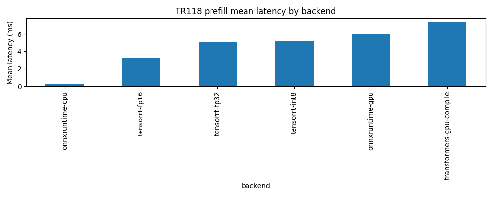
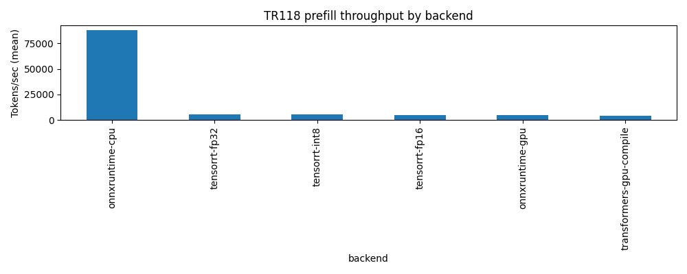
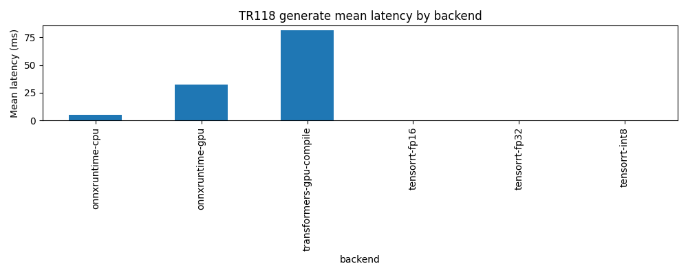
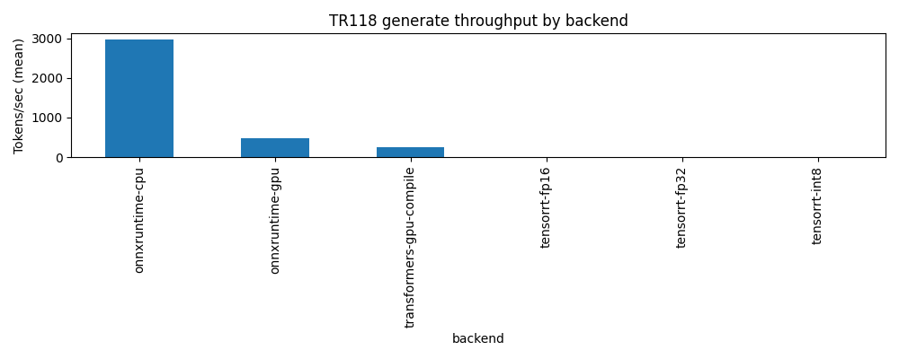

# Technical Report 118: ONNX Runtime + TensorRT Deep Dive


**Version:** 1.0
**Date:** 2025-12-13
**Status:** Draft (auto-generated from artifacts)
**Git SHA:** `f73684a2d4d8a87c52032f18dcff57dc3c9584f6`

## Abstract

TR118 deep-dives ONNX Runtime and TensorRT for local-first LLM inference, closing the TR117 gap where ONNX/TRT runs were fully degraded.
We report performance, degraded-rate, and accuracy (perplexity) gates, using artifact-driven reproducibility (JSONL + CSV + manifests).

## Executive Summary

### Key Findings

- Reliability: 360 run-level records across prefill, generate; degraded-rate = 27.8% (100/360)
- Accuracy: perplexity gate not fully satisfied (see `C:\Users\sahil\OneDrive\Documents\GitHub\Banterhearts\scripts\tr118\results\tr118v2\20251213_135135_deep\tiny-gpt2\processed\perplexity_results.csv`)
- prefill: best mean latency = onnxruntime-cpu (0.306 ms), vs baseline transformers-gpu-compile (7.42 ms, -95.88%)
- generate: best mean latency = onnxruntime-cpu (5.02 ms), vs baseline transformers-gpu-compile (81.5 ms, -93.85%)
- Note: PyTorch `transformers-gpu-compile` uses `torch.compile(..., backend="cudagraphs", dynamic=False)` on Windows (no Triton).

### Honest Limitations

- `generate` mode is an uncached greedy loop (`use_cache=False`) and is not representative of KV-cached decoding throughput.
- `models/tiny-gpt2` in this repo is a toy/untrained model; perplexity is expected to be near-uniform (~vocab) and accuracy deltas mainly reflect numerical consistency.
- Single model (gpt2/124M) and single machine; results may not generalize to larger models (see TR121).
- Latency excludes end-to-end serving overhead (tokenization, networking, batching policies).

## Introduction

- TR117 established a cross-backend baseline and identified ONNX/TRT infrastructure failures.
- TR118 focuses on making ONNX export + TRT engine builds real and measurable, with explicit degraded reasons and accuracy gates.

## Methodology

### Metrics
- Latency (ms), throughput (tok/s), degraded rate.
- Generation mode (if enabled) uses an uncached greedy loop (repeated full forward passes).

### Accuracy Gate
- Perplexity on WikiText-2 vs PyTorch baseline with per-precision thresholds.

### Statistical Analysis
- 95% confidence intervals + t-tests + Cohen's d via TR117 helpers.

## Experimental Design

- Config: `C:\Users\sahil\OneDrive\Documents\GitHub\Banterhearts\scripts\tr118\results\tr118v2\20251213_135135_deep\tiny-gpt2\processed\config_generated_tr118v2_tiny.yaml`
- Prompt config: `C:\Users\sahil\OneDrive\Documents\GitHub\Banterhearts\scripts\tr117\configs\matrix_tier3.yaml`
- Modes: prefill, generate
- Backends: transformers-gpu-compile, onnxruntime-cpu, onnxruntime-gpu, tensorrt-fp32, tensorrt-fp16, tensorrt-int8
- Scenarios: single_micro, single_short, single_medium, single_long, batch_short, batch_medium
- Repetitions: 5

**Artifacts root:** `C:\Users\sahil\OneDrive\Documents\GitHub\Banterhearts\scripts\tr118\results\tr118v2\20251213_135135_deep\tiny-gpt2`

### Run Manifest

- Manifest: `C:\Users\sahil\OneDrive\Documents\GitHub\Banterhearts\scripts\tr118\results\tr118v2\20251213_135135_deep\tiny-gpt2\processed\experiment_manifest_1765651895.json`
- Duration (s): 190.92559456825256

## Environment

- OS: Windows-11-10.0.26200-SP0
- Python: 3.13.1 (tags/v3.13.1:0671451, Dec  3 2024, 19:06:28) [MSC v.1942 64 bit (AMD64)]
- GPU: NVIDIA GeForce RTX 4080 Laptop GPU (12282 MB, CC 8.9)
- ONNXRuntime providers: TensorrtExecutionProvider, CUDAExecutionProvider, CPUExecutionProvider
- Key packages: torch=2.8.0+cu128, transformers=4.57.0, onnxruntime=1.23.2, tensorrt=10.12.0.36

## Sanity Checks

### Model / ONNX Artifacts

| Field | Value |
| --- | --- |
| model | models/tiny-gpt2 |
| onnx_path | C:\Users\sahil\OneDrive\Documents\GitHub\Banterhearts\artifacts\tr118v2\tiny-gpt2\onnx\tiny-gpt2.onnx |
| onnx_sha256 | 9a33f688342aa5860dd9863d416f47e9e81fcb244aa9bdc2b857c9ff1b22f3c0 |
| onnx_file_size_mb | 0.8649 |
| external_data | False |
| external_total_mb | 0 |
| total_artifact_mb | 0.8649 |
| initializer_numel_est | 203190 |
| initializer_bytes_est_mb | 0.7751 |
| weight_files_total_mb | 3.221 |

- Weight files: flax_model.msgpack: 0.39257240295410156, pytorch_model.bin: 2.397676467895508, tf_model.h5: 0.43117523193359375

### TensorRT Engine Inspection

| Precision | Plan_MB | Layers | InspectorType | INT8_in_JSON | INT8_tensors | OutputDTypes | CalibSource | CalibCacheHit |
| --- | --- | --- | --- | --- | --- | --- | --- | --- |
| fp32 | 5.255 | 163 | dict | False | False | Float=143, Int64=45 | N/A | N/A |
| fp16 | 2.166 | 33 | dict | False | False | Float=29, Int64=9 | N/A | N/A |
| int8 | 3.624 | 186 | dict | False | False | Float=171, Int64=46 | dataset | False |

### Perplexity Correctness

| Field | Value |
| --- | --- |
| baseline_ppl | 5.029e+04 |
| baseline_mean_nll | 10.83 |
| baseline_token_count | 72531 |
| ln_vocab | 10.82 |
| expected_uniform_ppl | 5.026e+04 |
| ref_loss_mean_nll | 10.82 |
| ref_loss_ppl | 5.019e+04 |

### Logit Diffs vs PyTorch (Last Token)

| Backend | mean_abs | max_abs | providers_used | error |
| --- | --- | --- | --- | --- |
| onnxruntime-cpu | 6.7e-09 | 3.725e-08 | ['CPUExecutionProvider'] | N/A |
| onnxruntime-gpu | 0 | 0 | ['CUDAExecutionProvider', 'CPUExecutionProvider'] | N/A |
| tensorrt-fp32 | 6.376e-09 | 3.725e-08 | N/A | N/A |
| tensorrt-fp16 | N/A | N/A | N/A | RuntimeError: set_input_shape_failed:input_ids:1x128 |
| tensorrt-int8 | 5.181e-10 | 7.451e-09 | N/A | N/A |

### Sanity Warnings

- TensorRT INT8 engine inspector does not report INT8 coverage; treat INT8 claims as unverified (likely FP16/FP32 fallback).

## Results

### Mode: `prefill`

#### Overall Backend Summary (Run-Level)

| Backend | n_ok | n_total | degraded_rate | lat_mean_ms | lat_ci95 | thr_mean_tok_s | thr_ci95 |
| --- | --- | --- | --- | --- | --- | --- | --- |
| onnxruntime-cpu | 30 | 30 | 0 | 0.3061 | [0.2591, 0.3532] | 8.8e+04 | [7.507e+04, 1.009e+05] |
| tensorrt-fp16 | 20 | 30 | 0.3333 | 3.296 | [2.771, 3.821] | 4831 | [4483, 5178] |
| tensorrt-fp32 | 30 | 30 | 0 | 5.069 | [3.878, 6.259] | 5620 | [5274, 5965] |
| tensorrt-int8 | 30 | 30 | 0 | 5.23 | [4.082, 6.378] | 5424 | [4981, 5867] |
| onnxruntime-gpu | 30 | 30 | 0 | 5.996 | [4.928, 7.064] | 4527 | [3960, 5094] |
| transformers-gpu-compile | 30 | 30 | 0 | 7.423 | [5.661, 9.186] | 4011 | [3525, 4496] |

#### Resource Summary (Run-Level)

| Backend | n_ok | gpu_power_mean_w | gpu_mem_peak_mb | gpu_temp_peak_c | cpu_mem_peak_mb |
| --- | --- | --- | --- | --- | --- |
| onnxruntime-cpu | 30 | 2.492 | 811 | 44 | 3620 |
| onnxruntime-gpu | 30 | 2.814 | 833.7 | 44.53 | 3765 |
| tensorrt-fp16 | 20 | 3.128 | 890.9 | 44 | 3809 |
| tensorrt-fp32 | 30 | 3.097 | 893.6 | 44 | 3800 |
| tensorrt-int8 | 30 | 2.87 | 899.6 | 43.1 | 3797 |
| transformers-gpu-compile | 30 | 3.057 | 776.8 | 44 | 3569 |

- Summary CSV: `C:\Users\sahil\OneDrive\Documents\GitHub\Banterhearts\scripts\tr118\results\tr118v2\20251213_135135_deep\tiny-gpt2\processed\latency_summary_prefill.csv`

#### Baseline Comparisons (Overall)

| baseline | candidate | metric | mean_a | mean_b | pct_change | p_value | cohens_d | significant |
| --- | --- | --- | --- | --- | --- | --- | --- | --- |
| transformers-gpu-compile | onnxruntime-cpu | latency_ms | 7.423 | 0.3061 | -95.88 | 2.292e-11 | -2.131 | True |
| transformers-gpu-compile | onnxruntime-gpu | latency_ms | 7.423 | 5.996 | -19.23 | 0.1619 | -0.3658 | False |
| transformers-gpu-compile | tensorrt-fp16 | latency_ms | 7.423 | 3.296 | -55.6 | 0.0003753 | -1.105 | True |
| transformers-gpu-compile | tensorrt-fp32 | latency_ms | 7.423 | 5.069 | -31.72 | 0.02733 | -0.5846 | True |
| transformers-gpu-compile | tensorrt-int8 | latency_ms | 7.423 | 5.23 | -29.55 | 0.03722 | -0.5506 | True |

#### Figures






### Mode: `generate`

#### Overall Backend Summary (Run-Level)

| Backend | n_ok | n_total | degraded_rate | lat_mean_ms | lat_ci95 | thr_mean_tok_s | thr_ci95 |
| --- | --- | --- | --- | --- | --- | --- | --- |
| onnxruntime-cpu | 30 | 30 | 0 | 5.017 | [4.185, 5.849] | 2970 | [2533, 3406] |
| onnxruntime-gpu | 30 | 30 | 0 | 32.61 | [29.85, 35.37] | 467.7 | [360.5, 574.8] |
| transformers-gpu-compile | 30 | 30 | 0 | 81.54 | [67.05, 96.02] | 241.1 | [173.8, 308.5] |
| tensorrt-fp16 | 0 | 30 | 1 | N/A | N/A | N/A | N/A |
| tensorrt-fp32 | 0 | 30 | 1 | N/A | N/A | N/A | N/A |
| tensorrt-int8 | 0 | 30 | 1 | N/A | N/A | N/A | N/A |

#### TTFT Summary (Run-Level)

| Backend | n_ok | ttft_mean_ms | ttft_ci95 | ttft_median_ms |
| --- | --- | --- | --- | --- |
| onnxruntime-cpu | 30 | 0.5822 | [0.4981, 0.6663] | 0.5009 |
| onnxruntime-gpu | 30 | 4.089 | [3.752, 4.425] | 3.949 |
| transformers-gpu-compile | 30 | 9.754 | [8.006, 11.5] | 9.969 |

#### Resource Summary (Run-Level)

| Backend | n_ok | gpu_power_mean_w | gpu_mem_peak_mb | gpu_temp_peak_c | cpu_mem_peak_mb |
| --- | --- | --- | --- | --- | --- |
| onnxruntime-cpu | 30 | 16.25 | 654 | 46.8 | 1587 |
| onnxruntime-gpu | 30 | 10.67 | 684 | 47.13 | 1799 |
| transformers-gpu-compile | 30 | 21.67 | 590.7 | 46.7 | 1484 |

- Summary CSV: `C:\Users\sahil\OneDrive\Documents\GitHub\Banterhearts\scripts\tr118\results\tr118v2\20251213_135135_deep\tiny-gpt2\processed\latency_summary_generate.csv`

#### Baseline Comparisons (Overall)

| baseline | candidate | metric | mean_a | mean_b | pct_change | p_value | cohens_d | significant |
| --- | --- | --- | --- | --- | --- | --- | --- | --- |
| transformers-gpu-compile | onnxruntime-cpu | latency_ms | 81.54 | 5.017 | -93.85 | 1.745e-15 | -2.785 | True |
| transformers-gpu-compile | onnxruntime-gpu | latency_ms | 81.54 | 32.61 | -60.01 | 6.691e-09 | -1.752 | True |

#### Figures






### Accuracy (Perplexity Gate)

- Results CSV: `C:\Users\sahil\OneDrive\Documents\GitHub\Banterhearts\scripts\tr118\results\tr118v2\20251213_135135_deep\tiny-gpt2\processed\perplexity_results.csv`
- Diagnostics JSON: `C:\Users\sahil\OneDrive\Documents\GitHub\Banterhearts\scripts\tr118\results\tr118v2\20251213_135135_deep\tiny-gpt2\processed\perplexity_results.json`

| Backend | PPL | delta_frac | Threshold | Pass | Error |
| --- | --- | --- | --- | --- | --- |
| transformers-gpu-compile | 5.029e+04 | 0 | nan | True | nan |
| onnxruntime-cpu | 5.029e+04 | -2.714e-08 | 0.001 | True | nan |
| onnxruntime-gpu | 5.029e+04 | -2.209e-08 | 0.001 | True | nan |
| tensorrt-fp32 | 5.029e+04 | -2.377e-08 | 0.001 | True | nan |
| tensorrt-fp16 | nan | nan | nan | False | set_input_shape_failed:input_ids:4x128 |
| tensorrt-int8 | 5.029e+04 | -2.377e-08 | 0.02 | True | nan |

### Export Overhead (ONNX)

| Field | Value |
| --- | --- |
| onnx_path | C:\Users\sahil\OneDrive\Documents\GitHub\Banterhearts\artifacts\tr118v2\tiny-gpt2\onnx\tiny-gpt2.onnx |
| export_time_s | N/A |
| file_size_mb | 0.8649 |
| opset_version | 17 |
| dynamic_axes | True |
| trt_friendly_inputs | True |
| reused | True |
| valid | N/A |
| onnx_sha256 | 9a33f688342aa5860dd9863d416f47e9e81fcb244aa9bdc2b857c9ff1b22f3c0 |

### TensorRT Build Overhead

- Build metadata: `C:\Users\sahil\OneDrive\Documents\GitHub\Banterhearts\scripts\tr118\results\tr118v2\20251213_135135_deep\tiny-gpt2\processed\trt_build_metadata_1765651895.json`

| Precision | Plan | Built | Reused | Build s | Size MB | Dynamic | Profiles | Error |
| --- | --- | --- | --- | --- | --- | --- | --- | --- |
| fp32 | tiny-gpt2_fp32.plan | True | False | 15.03 | 5.255 | True | 5 | N/A |
| fp16 | tiny-gpt2_fp16.plan | False | True | N/A | 2.166 | True | 5 | N/A |
| int8 | tiny-gpt2_int8.plan | True | False | 30.76 | 3.624 | True | 5 | N/A |

## Discussion

### Interpretation
- This run demonstrates that ONNX export + TensorRT engine builds can be made reliable on a single Windows + CUDA workstation.
- For this tiny model and short prompts, ORT-CPU can win on latency due to reduced GPU launch/dispatch overhead; larger models should re-test (TR121).
- TensorRT build cost is non-trivial; treat it as an offline step that must be amortized for production value.

### Limitations / Threats to Validity
- See `Executive Summary: Honest Limitations` for the primary caveats.

## Conclusions

TR118 provides an artifact-driven pipeline for measuring ONNX Runtime and TensorRT locally, including degraded-rate accounting, build/export metadata, and perplexity gates.

## Recommendations

- If you need portability/simplicity: start with ONNX Runtime (CPU or CUDA EP).
- If you can prebuild engines and need maximum GPU throughput: TensorRT (FP16/INT8 as permitted by accuracy gates).
- Keep PyTorch as the reference baseline; on Windows prefer `torch.compile(..., backend="cudagraphs", dynamic=False)` for stability.

## Reproducibility

Run the full pipeline:

```bash
python scripts/tr118/run_experiment.py --config C:\Users\sahil\OneDrive\Documents\GitHub\Banterhearts\scripts\tr118\results\tr118v2\20251213_135135_deep\tiny-gpt2\processed\config_generated_tr118v2_tiny.yaml --device cuda
```

Generate this report from artifacts:

```bash
python scripts/tr118/generate_report.py --config C:\Users\sahil\OneDrive\Documents\GitHub\Banterhearts\scripts\tr118\results\tr118v2\20251213_135135_deep\tiny-gpt2\processed\config_generated_tr118v2_tiny.yaml --manifest C:\Users\sahil\OneDrive\Documents\GitHub\Banterhearts\scripts\tr118\results\tr118v2\20251213_135135_deep\tiny-gpt2\processed\experiment_manifest_1765651895.json
```

## Appendix

- Artifacts root: `C:\Users\sahil\OneDrive\Documents\GitHub\Banterhearts\scripts\tr118\results\tr118v2\20251213_135135_deep\tiny-gpt2`
- Processed dir: `C:\Users\sahil\OneDrive\Documents\GitHub\Banterhearts\scripts\tr118\results\tr118v2\20251213_135135_deep\tiny-gpt2\processed`
