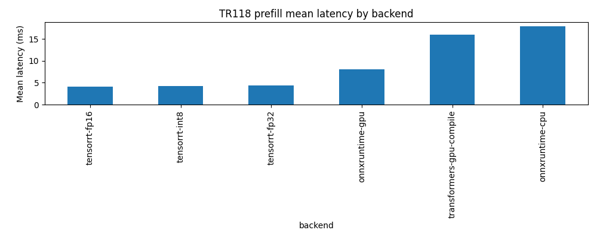
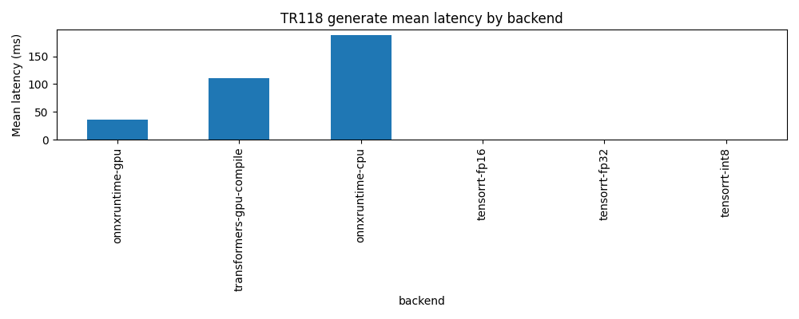
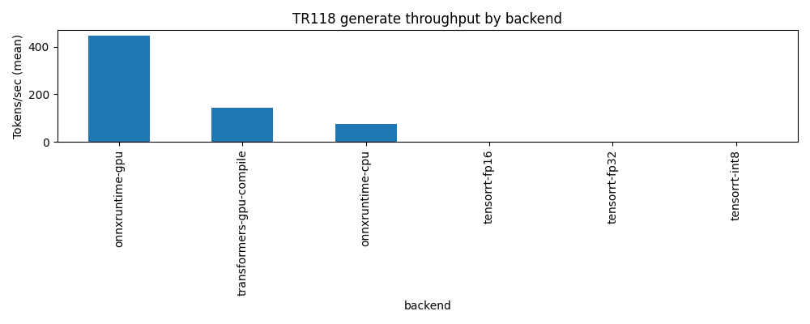

# Technical Report 118: ONNX Runtime + TensorRT Deep Dive


**Version:** 1.0
**Date:** 2025-12-13
**Status:** Draft (auto-generated from artifacts)
**Git SHA:** `f73684a2d4d8a87c52032f18dcff57dc3c9584f6`

## Abstract

TR118 deep-dives ONNX Runtime and TensorRT for local-first LLM inference, closing the TR117 gap where ONNX/TRT runs were fully degraded.
We report performance, degraded-rate, and accuracy (perplexity) gates, using artifact-driven reproducibility (JSONL + CSV + manifests).

## Executive Summary

### Key Findings

- Reliability: 360 run-level records across prefill, generate; degraded-rate = 25.0% (90/360)
- Accuracy: perplexity gate passed (see `C:\Users\sahil\OneDrive\Documents\GitHub\Banterhearts\scripts\tr118\results\tr118v2\20251213_141057_deep_fp16_fix\gpt2\processed\perplexity_results.csv`)
- prefill: best mean latency = tensorrt-fp16 (4.07 ms), vs baseline transformers-gpu-compile (16 ms, -74.50%)
- generate: best mean latency = onnxruntime-gpu (35.8 ms), vs baseline transformers-gpu-compile (110 ms, -67.42%)
- Note: PyTorch `transformers-gpu-compile` uses `torch.compile(..., backend="cudagraphs", dynamic=False)` on Windows (no Triton).

### Honest Limitations

- `generate` mode is an uncached greedy loop (`use_cache=False`) and is not representative of KV-cached decoding throughput.
- `models/tiny-gpt2` in this repo is a toy/untrained model; perplexity is expected to be near-uniform (~vocab) and accuracy deltas mainly reflect numerical consistency.
- Single model (gpt2/124M) and single machine; results may not generalize to larger models (see TR121).
- Latency excludes end-to-end serving overhead (tokenization, networking, batching policies).

## Introduction

- TR117 established a cross-backend baseline and identified ONNX/TRT infrastructure failures.
- TR118 focuses on making ONNX export + TRT engine builds real and measurable, with explicit degraded reasons and accuracy gates.

## Methodology

### Metrics
- Latency (ms), throughput (tok/s), degraded rate.
- Generation mode (if enabled) uses an uncached greedy loop (repeated full forward passes).

### Accuracy Gate
- Perplexity on WikiText-2 vs PyTorch baseline with per-precision thresholds.

### Statistical Analysis
- 95% confidence intervals + t-tests + Cohen's d via TR117 helpers.

## Experimental Design

- Config: `C:\Users\sahil\OneDrive\Documents\GitHub\Banterhearts\scripts\tr118\results\tr118v2\20251213_141057_deep_fp16_fix\gpt2\processed\config_generated_tr118v2_gpt2.yaml`
- Prompt config: `C:\Users\sahil\OneDrive\Documents\GitHub\Banterhearts\scripts\tr117\configs\matrix_tier3.yaml`
- Modes: prefill, generate
- Backends: transformers-gpu-compile, onnxruntime-cpu, onnxruntime-gpu, tensorrt-fp32, tensorrt-fp16, tensorrt-int8
- Scenarios: single_micro, single_short, single_medium, single_long, batch_short, batch_medium
- Repetitions: 5

**Artifacts root:** `C:\Users\sahil\OneDrive\Documents\GitHub\Banterhearts\scripts\tr118\results\tr118v2\20251213_141057_deep_fp16_fix\gpt2`

### Run Manifest

- Manifest: `C:\Users\sahil\OneDrive\Documents\GitHub\Banterhearts\scripts\tr118\results\tr118v2\20251213_141057_deep_fp16_fix\gpt2\processed\experiment_manifest_1765653057.json`
- Duration (s): 490.2439465522766

## Environment

- OS: Windows-11-10.0.26200-SP0
- Python: 3.13.1 (tags/v3.13.1:0671451, Dec  3 2024, 19:06:28) [MSC v.1942 64 bit (AMD64)]
- GPU: NVIDIA GeForce RTX 4080 Laptop GPU (12282 MB, CC 8.9)
- ONNXRuntime providers: TensorrtExecutionProvider, CUDAExecutionProvider, CPUExecutionProvider
- Key packages: torch=2.8.0+cu128, transformers=4.57.0, onnxruntime=1.23.2, tensorrt=10.12.0.36

## Sanity Checks

### Model / ONNX Artifacts

| Field | Value |
| --- | --- |
| model | gpt2 |
| onnx_path | C:\Users\sahil\OneDrive\Documents\GitHub\Banterhearts\artifacts\tr118v2\gpt2\onnx\gpt2.onnx |
| onnx_sha256 | N/A |
| onnx_file_size_mb | 622.4 |
| external_data | False |
| external_total_mb | 0 |
| total_artifact_mb | 622.4 |
| initializer_numel_est | 163037184 |
| initializer_bytes_est_mb | 621.9 |
| weight_files_total_mb | N/A |

### TensorRT Engine Inspection

| Precision | Plan_MB | Layers | InspectorType | INT8_in_JSON | INT8_tensors | OutputDTypes | CalibSource | CalibCacheHit |
| --- | --- | --- | --- | --- | --- | --- | --- | --- |
| fp32 | 778.4 | 901 | dict | False | False | Float=780, Int64=248 | N/A | N/A |
| fp16 | 941.8 | 792 | dict | False | False | Float=450, Half=224, Int64=243 | N/A | N/A |
| int8 | 779.9 | 1025 | dict | False | False | Float=930, Int64=249 | dataset | True |

### Perplexity Correctness

| Field | Value |
| --- | --- |
| baseline_ppl | 58.34 |
| baseline_mean_nll | 4.066 |
| baseline_token_count | 72531 |
| ln_vocab | 10.82 |
| expected_uniform_ppl | 5.026e+04 |
| ref_loss_mean_nll | 4.138 |
| ref_loss_ppl | 62.7 |

### Logit Diffs vs PyTorch (Last Token)

| Backend | mean_abs | max_abs | providers_used | error |
| --- | --- | --- | --- | --- |
| onnxruntime-cpu | 4.125e-05 | 0.0002136 | ['CPUExecutionProvider'] | N/A |
| onnxruntime-gpu | 0.02025 | 0.05012 | ['CUDAExecutionProvider', 'CPUExecutionProvider'] | N/A |
| tensorrt-fp32 | 0.006077 | 0.03185 | N/A | N/A |
| tensorrt-fp16 | 0.01684 | 0.04313 | N/A | N/A |
| tensorrt-int8 | 0.008242 | 0.03571 | N/A | N/A |

### Sanity Warnings

- TensorRT INT8 engine inspector does not report INT8 coverage; treat INT8 claims as unverified (likely FP16/FP32 fallback).

## Results

### Mode: `prefill`

#### Overall Backend Summary (Run-Level)

| Backend | n_ok | n_total | degraded_rate | lat_mean_ms | lat_ci95 | thr_mean_tok_s | thr_ci95 |
| --- | --- | --- | --- | --- | --- | --- | --- |
| tensorrt-fp16 | 30 | 30 | 0 | 4.068 | [2.803, 5.332] | 8271 | [7409, 9132] |
| tensorrt-int8 | 30 | 30 | 0 | 4.298 | [3.32, 5.275] | 6608 | [5994, 7223] |
| tensorrt-fp32 | 30 | 30 | 0 | 4.385 | [3.371, 5.399] | 6559 | [5910, 7208] |
| onnxruntime-gpu | 30 | 30 | 0 | 8.069 | [4.954, 11.18] | 5158 | [4148, 6167] |
| transformers-gpu-compile | 30 | 30 | 0 | 15.95 | [11.91, 19.99] | 2161 | [1600, 2723] |
| onnxruntime-cpu | 30 | 30 | 0 | 17.88 | [15.13, 20.63] | 1512 | [1284, 1740] |

#### Resource Summary (Run-Level)

| Backend | n_ok | gpu_power_mean_w | gpu_mem_peak_mb | gpu_temp_peak_c | cpu_mem_peak_mb |
| --- | --- | --- | --- | --- | --- |
| onnxruntime-cpu | 30 | 12.75 | 5449 | 43.07 | 3718 |
| onnxruntime-gpu | 30 | 25.84 | 5459 | 44.27 | 3872 |
| tensorrt-fp16 | 30 | 23.28 | 7788 | 43.53 | 3952 |
| tensorrt-fp32 | 30 | 24.76 | 6472 | 43.97 | 3934 |
| tensorrt-int8 | 30 | 25.4 | 8769 | 43.47 | 3944 |
| transformers-gpu-compile | 30 | 17.21 | 4145 | 44.17 | 3731 |

- Summary CSV: `C:\Users\sahil\OneDrive\Documents\GitHub\Banterhearts\scripts\tr118\results\tr118v2\20251213_141057_deep_fp16_fix\gpt2\processed\latency_summary_prefill.csv`

#### Baseline Comparisons (Overall)

| baseline | candidate | metric | mean_a | mean_b | pct_change | p_value | cohens_d | significant |
| --- | --- | --- | --- | --- | --- | --- | --- | --- |
| transformers-gpu-compile | onnxruntime-cpu | latency_ms | 15.95 | 17.88 | 12.09 | 0.4231 | 0.2083 | False |
| transformers-gpu-compile | onnxruntime-gpu | latency_ms | 15.95 | 8.069 | -49.42 | 0.002515 | -0.8156 | True |
| transformers-gpu-compile | tensorrt-fp16 | latency_ms | 15.95 | 4.068 | -74.5 | 3.66e-07 | -1.482 | True |
| transformers-gpu-compile | tensorrt-fp32 | latency_ms | 15.95 | 4.385 | -72.51 | 4.622e-07 | -1.466 | True |
| transformers-gpu-compile | tensorrt-int8 | latency_ms | 15.95 | 4.298 | -73.06 | 3.763e-07 | -1.48 | True |

#### Figures




### Mode: `generate`

#### Overall Backend Summary (Run-Level)

| Backend | n_ok | n_total | degraded_rate | lat_mean_ms | lat_ci95 | thr_mean_tok_s | thr_ci95 |
| --- | --- | --- | --- | --- | --- | --- | --- |
| onnxruntime-gpu | 30 | 30 | 0 | 35.84 | [30.09, 41.6] | 447.6 | [346.2, 548.9] |
| transformers-gpu-compile | 30 | 30 | 0 | 110 | [98.42, 121.6] | 143.5 | [113.8, 173.1] |
| onnxruntime-cpu | 30 | 30 | 0 | 188.3 | [157.5, 219] | 76.95 | [67.77, 86.13] |
| tensorrt-fp16 | 0 | 30 | 1 | N/A | N/A | N/A | N/A |
| tensorrt-fp32 | 0 | 30 | 1 | N/A | N/A | N/A | N/A |
| tensorrt-int8 | 0 | 30 | 1 | N/A | N/A | N/A | N/A |

#### TTFT Summary (Run-Level)

| Backend | n_ok | ttft_mean_ms | ttft_ci95 | ttft_median_ms |
| --- | --- | --- | --- | --- |
| onnxruntime-gpu | 30 | 4.8 | [3.392, 6.207] | 3.921 |
| transformers-gpu-compile | 30 | 13.29 | [11.89, 14.69] | 13.94 |
| onnxruntime-cpu | 30 | 23.55 | [19.52, 27.57] | 18.31 |

#### Resource Summary (Run-Level)

| Backend | n_ok | gpu_power_mean_w | gpu_mem_peak_mb | gpu_temp_peak_c | cpu_mem_peak_mb |
| --- | --- | --- | --- | --- | --- |
| onnxruntime-cpu | 30 | 11.24 | 5758 | 44.4 | 2202 |
| onnxruntime-gpu | 30 | 53.92 | 5768 | 47.67 | 2422 |
| transformers-gpu-compile | 30 | 31.77 | 4456 | 45.43 | 2179 |

- Summary CSV: `C:\Users\sahil\OneDrive\Documents\GitHub\Banterhearts\scripts\tr118\results\tr118v2\20251213_141057_deep_fp16_fix\gpt2\processed\latency_summary_generate.csv`

#### Baseline Comparisons (Overall)

| baseline | candidate | metric | mean_a | mean_b | pct_change | p_value | cohens_d | significant |
| --- | --- | --- | --- | --- | --- | --- | --- | --- |
| transformers-gpu-compile | onnxruntime-cpu | latency_ms | 110 | 188.3 | 71.1 | 8.969e-06 | 1.257 | True |
| transformers-gpu-compile | onnxruntime-gpu | latency_ms | 110 | 35.84 | -67.42 | 6.516e-17 | -3.023 | True |

#### Figures






### Accuracy (Perplexity Gate)

- Results CSV: `C:\Users\sahil\OneDrive\Documents\GitHub\Banterhearts\scripts\tr118\results\tr118v2\20251213_141057_deep_fp16_fix\gpt2\processed\perplexity_results.csv`
- Diagnostics JSON: `C:\Users\sahil\OneDrive\Documents\GitHub\Banterhearts\scripts\tr118\results\tr118v2\20251213_141057_deep_fp16_fix\gpt2\processed\perplexity_results.json`

| Backend | PPL | delta_frac | Threshold | Pass | Error |
| --- | --- | --- | --- | --- | --- |
| transformers-gpu-compile | 58.34 | 0 | nan | True | N/A |
| onnxruntime-cpu | 58.34 | -1.354e-05 | 0.001 | True | N/A |
| onnxruntime-gpu | 58.35 | 0.0001874 | 0.001 | True | N/A |
| tensorrt-fp32 | 58.35 | 3.047e-05 | 0.001 | True | N/A |
| tensorrt-fp16 | 58.36 | 0.0002124 | 0.005 | True | N/A |
| tensorrt-int8 | 58.35 | 3.053e-05 | 0.02 | True | N/A |

### Export Overhead (ONNX)

| Field | Value |
| --- | --- |
| onnx_path | C:\Users\sahil\OneDrive\Documents\GitHub\Banterhearts\artifacts\tr118v2\gpt2\onnx\gpt2.onnx |
| export_time_s | N/A |
| file_size_mb | 622.4 |
| opset_version | 17 |
| dynamic_axes | True |
| trt_friendly_inputs | True |
| reused | True |
| valid | N/A |
| onnx_sha256 | N/A |

### TensorRT Build Overhead

- Build metadata: `C:\Users\sahil\OneDrive\Documents\GitHub\Banterhearts\scripts\tr118\results\tr118v2\20251213_141057_deep_fp16_fix\gpt2\processed\trt_build_metadata_1765653057.json`

| Precision | Plan | Built | Reused | Build s | Size MB | Dynamic | Profiles | Error |
| --- | --- | --- | --- | --- | --- | --- | --- | --- |
| fp32 | gpt2_fp32.plan | True | False | 57.24 | 778.4 | True | 5 | N/A |
| fp16 | gpt2_fp16.plan | True | False | 96.85 | 941.8 | True | 5 | N/A |
| int8 | gpt2_int8.plan | True | False | 83.41 | 779.9 | True | 5 | N/A |

## Discussion

### Interpretation
- This run demonstrates that ONNX export + TensorRT engine builds can be made reliable on a single Windows + CUDA workstation.
- For this tiny model and short prompts, ORT-CPU can win on latency due to reduced GPU launch/dispatch overhead; larger models should re-test (TR121).
- TensorRT build cost is non-trivial; treat it as an offline step that must be amortized for production value.

### Limitations / Threats to Validity
- See `Executive Summary: Honest Limitations` for the primary caveats.

## Conclusions

TR118 provides an artifact-driven pipeline for measuring ONNX Runtime and TensorRT locally, including degraded-rate accounting, build/export metadata, and perplexity gates.

## Recommendations

- If you need portability/simplicity: start with ONNX Runtime (CPU or CUDA EP).
- If you can prebuild engines and need maximum GPU throughput: TensorRT (FP16/INT8 as permitted by accuracy gates).
- Keep PyTorch as the reference baseline; on Windows prefer `torch.compile(..., backend="cudagraphs", dynamic=False)` for stability.

## Reproducibility

Run the full pipeline:

```bash
python scripts/tr118/run_experiment.py --config C:\Users\sahil\OneDrive\Documents\GitHub\Banterhearts\scripts\tr118\results\tr118v2\20251213_141057_deep_fp16_fix\gpt2\processed\config_generated_tr118v2_gpt2.yaml --device cuda
```

Generate this report from artifacts:

```bash
python scripts/tr118/generate_report.py --config C:\Users\sahil\OneDrive\Documents\GitHub\Banterhearts\scripts\tr118\results\tr118v2\20251213_141057_deep_fp16_fix\gpt2\processed\config_generated_tr118v2_gpt2.yaml --manifest C:\Users\sahil\OneDrive\Documents\GitHub\Banterhearts\scripts\tr118\results\tr118v2\20251213_141057_deep_fp16_fix\gpt2\processed\experiment_manifest_1765653057.json
```

## Appendix

- Artifacts root: `C:\Users\sahil\OneDrive\Documents\GitHub\Banterhearts\scripts\tr118\results\tr118v2\20251213_141057_deep_fp16_fix\gpt2`
- Processed dir: `C:\Users\sahil\OneDrive\Documents\GitHub\Banterhearts\scripts\tr118\results\tr118v2\20251213_141057_deep_fp16_fix\gpt2\processed`
